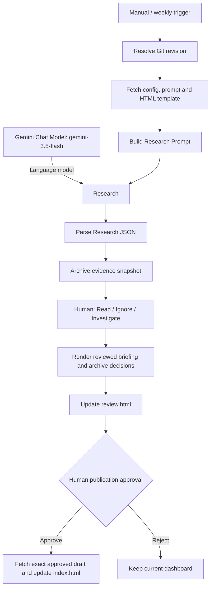

# Engineering Journalist

Source-controlled n8n workflow for IC design engineers, prepared for **adhammo/engineering-journalist**, branch `main`, and n8n 2.38.7.

## Model and workflow

The **Research** node is a Basic LLM Chain connected to **Google Gemini Chat Model**, with **`models/gemini-3.5-flash` hardcoded in that node**. The model is not read from the config file. The parser consumes the chain's `text` output. Gemini HTTP research and retry nodes have been removed.



**Research capability:** naming a node Research does not give the model a web-search tool. This configuration does not attach a search tool. Text-only results are marked `unverified_model_output`; coverage is marked `not_verified`, regardless of the model's written claims. The prompt asks for no findings when current sources cannot be accessed. Without external evidence or a separately configured retrieval capability, this is a human-reviewed candidate-generation flow, not independently verified live monitoring.

The reviewer must independently check original source pages and choose **Source verification: Confirmed** before any Read item can enter the briefing. Ignore excludes an item; Investigate holds it for manual follow-up. Final approval publishes the exact reviewed bytes. Zero results never prove that no updates exist.

## Setup

1. Push this directory to `adhammo/engineering-journalist` on `main`.
2. Enable GitHub Pages from `main`, `/ (root)`, to view the HTML reports. Alternatively, download and open the HTML locally.
3. Import `engineering-journalist.json` into n8n.
4. Select your existing Gemini credential on **Google Gemini Chat Model**. The requested model must be available to your API account; no substitute is selected automatically.
5. Select your GitHub credential on the GitHub HTTP Request nodes, with Contents read/write permission for this repository. If using an existing Header Auth credential, change those nodes' authentication to Generic Credential Type / Header Auth.
6. Edit and push `engineering-journalist.config.json` to set the topic, keywords, exclusions and sources.
7. Run Manual Trigger. Open the waiting execution's form at Human Evidence Review. Verify the sources, assign decisions and confirm source checks for Read items.
8. Review the immutable draft at Human Publication Approval, then approve or reject.
9. Enable Weekly Schedule and publish the workflow after a successful test. It is disabled in the export; its schedule is Monday 09:00 Africa/Cairo.

Dashboard: <https://adhammo.github.io/engineering-journalist/>. Latest draft: <https://adhammo.github.io/engineering-journalist/review.html>. GitHub Pages may take time to deploy each commit. Always use the run-specific draft linked in the approval form.

## Source-controlled files

- `engineering-journalist.json`: generated, importable n8n workflow.
- `engineering-journalist.config.json`: topic and source scope, seven-day lookback, upcoming 90 days, maximum eight candidates.
- `research_prompt_template.md`: research instructions and JSON contract.
- `dashboard_template.html`: report layout and styles.
- Root `.js` files: Code-node implementations; `render-report.js` is the shared deterministic renderer.
- `scripts/build-workflow.cjs`: reproducible generator, including the hardcoded Gemini node.
- `tests/workflow.test.cjs`: offline checks for parsing, validation, human gates and publication.
- `index.html`, `review.html`: initial placeholders, subsequently updated by n8n.

Initial source scope: IEEE Xplore, arXiv and ACM Digital Library for papers; ISSCC, DAC, IEEE IMS and VLSI Symposia for conferences; UCIe for standards/webinars; IEEE SSCS for webinars. Adjust these for the selected topic. Domain and source-type checks remain enforced. arXiv identifier syntax checks do not establish that a paper exists.

## Versioning and publication

This follows the [competitive-intelligence-demo methodology](https://github.com/adhammo/competitive-intelligence-demo): external config, prompt and template; separate JavaScript sources; GitHub review artifacts; human approval before production publication.

Each run fetches config, prompt and template at one Git commit. Runtime edits never overwrite configuration. Code sources are embedded at build time, not remotely evaluated. Audits record the input Git revision and workflow build hash.

Config/prompt/template changes take effect after pushing, on the next run. For Code-node or workflow changes:

```sh
npm run build
npm test
npm run check
```

Commit source files and the generated export together, push, then reimport the workflow. Node.js 18+ is sufficient; no npm dependencies are required. Credentials are omitted from the export.

Each run archives `evidence.html`, `evidence.json`, `review.html`, and `publication-decision.json` under `runs/<run-id>/`. The final publisher fetches the approved draft at its commit SHA, verifies its blob identity and bytes, and updates `index.html` using GitHub's current file SHA. Reject leaves production unchanged. No AI call runs after evidence triage.

Keep one run in flight; the latest dashboard follows completed-approval order. Pull automated GitHub commits before pushing local changes. Resume form URLs stay in n8n. Repository artifacts follow repository visibility. Typed reviewer names are audit labels, not authenticated identities.

## Failure handling and teaching

Malformed JSON, empty answer text, invalid dates and incomplete human decisions stop publication. Invalid enums, out-of-scope records and placeholder paper URLs are excluded with reasons. Missing grounding metadata in chain text output produces visible warnings and mandatory source checking rather than a parser error. Raw API input, when supplied, retains its stricter provider-metadata checks.

Duplicates are filtered within each run. Historical runs are retained, but automated cross-week comparison and follow-up research are not implemented. Offline tests do not prove model availability, factual accuracy, API access or Pages deployment.

The 40-minute exercise uses 10 minutes for manual chat and 30 minutes for automation and failures: inspect Git-controlled inputs, run Research, inspect evidence, complete both human gates, then demonstrate invalid JSON, bad links, missing source confirmation and publication rejection.
