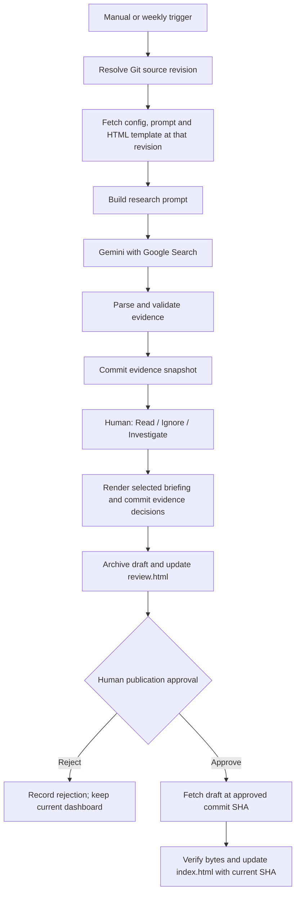

# Engineering Journalist

A source-controlled n8n demo for IC design engineers: **Gemini research → evidence artifact → Read / Ignore / Investigate → approved weekly HTML briefing**.

Prepared for **[adhammo/engineering-journalist](https://github.com/adhammo/engineering-journalist)**, branch `main`, and n8n **2.38.7**. This directory is the repository root. Push its contents before running the workflow.

The project follows the [competitive-intelligence-demo reference](https://github.com/adhammo/competitive-intelligence-demo): separate configuration and prompt files, a fixed HTML template, JavaScript Code-node sources, GitHub versioning, a review artifact, and explicit approval before promoting exact HTML to `index.html`.

## Quick start

1. Push this directory to `adhammo/engineering-journalist` on `main`.
2. In GitHub Pages, select **Deploy from a branch → main → / (root)**. `.nojekyll` is included. Pages is optional if you download and open the HTML locally.
3. Import **`engineering-journalist.json`** into n8n.
4. On each GitHub HTTP Request node, select your existing **GitHub API** credential with repository **Contents: read and write** access. Also allow access to this repository if your token is restricted to selected repositories. If your existing token uses Header Auth, switch those nodes to Generic Credential Type → Header Auth and select it instead.
5. On **Gemini Research**, select your existing **Google Gemini(PaLM) API** credential. This HTTP node enables Google Search using `generateContent`; it reuses the same API credential as the Gemini Chat Model. The starter model is `gemini-2.5-flash`; change `gemini_model` in the config if a different Search-capable model is available to your key.
6. Edit `engineering-journalist.config.json` for your topic and push the change. No topic is hardcoded in the workflow.
7. Run **Manual Trigger**. At **Human Evidence Review**, open the waiting execution's resume-form URL from n8n, inspect the linked evidence snapshot and original sources, then choose Read, Ignore or Investigate for each populated ID.
8. At **Human Publication Approval**, open the run-specific draft and choose **Approve** or **Reject**. Approve promotes the exact archived draft bytes to the root `index.html`; Reject preserves the existing dashboard.
9. After a successful run, enable **Weekly Schedule** and publish/activate the workflow. It is disabled in the export. The configured schedule is Monday at 09:00, Africa/Cairo; research date windows use UTC calendar dates.

GitHub Pages URLs after deployment:

- Dashboard: <https://adhammo.github.io/engineering-journalist/>
- Latest draft: <https://adhammo.github.io/engineering-journalist/review.html>
- Evidence and immutable drafts: `runs/<run-id>/evidence.html` and `runs/<run-id>/review.html`.

GitHub Pages can take time to deploy a new commit. Wait for the run-specific page to appear before reviewing, or download the HTML from the supplied GitHub link. The n8n resume-form URLs stay inside the execution and are not written to the public dashboard. Repository artifacts have the repository's visibility; use this demo with public research material.

## Architecture



The two human gates serve different purposes: per-item triage implements the exercise; final publication approval preserves the reference's exact-approved-artifact methodology. No AI call occurs after triage. Read is a reading recommendation, not technical endorsement.

## Repository files

| File | Purpose |
|---|---|
| `engineering-journalist.json` | Importable n8n export; generated from the files below |
| `engineering-journalist.config.json` | Topic, keywords, exclusions, audience, windows, model and source scope |
| `research_prompt_template.md` | Research instructions and evidence JSON contract |
| `dashboard_template.html` | Fixed report shell, layout and styles; named injection tokens |
| `repository-settings.js` | GitHub owner, repository and branch; no research scope |
| `build-research-prompt.js` | Decode fetched files, validate config and substitute prompt tokens |
| `parse-research-json.js` | Validate Gemini output, dates, source domains/types and duplicates |
| `render-report.js` | Shared deterministic renderer with HTML escaping |
| `render-draft-dashboard.js` | Build the evidence review artifact |
| `apply-human-decisions.js` | Require explicit decisions for all populated IDs |
| `render-reviewed-dashboard.js` | Render the triaged briefing using the original captured template |
| `prepare-review-commit.js` | Prepare creation/update of root `review.html` |
| `record-publication-decision.js` | Bind approval/rejection to the draft's Git commit and blob SHA |
| `prepare-publish-commit.js` | Verify and promote the exact approved HTML |
| `publication-result.js` | Return output URLs, counts and publication commit |
| `index.html`, `review.html` | Clearly labeled initial placeholders; updated by the workflow |
| `scripts/build-workflow.cjs` | Reproducible workflow generator; embeds local Code-node sources |
| `tests/workflow.test.cjs` | Offline reliability and source/export consistency tests |

For each run, n8n commits:

```text
runs/<run-id>/
  evidence.html             # evidence snapshot before triage
  evidence.json             # structured evidence, grounding and triage decisions
  review.html               # immutable candidate for publication
  publication-decision.json # explicit approval/rejection, approver and draft identity
```

## Configuration and initial scope

Change the topic and scope by editing **`engineering-journalist.config.json`**. The included chiplet topic is an editable example. The curated starting source list covers:

| Category | Starting sources |
|---|---|
| Papers | IEEE Xplore, arXiv, ACM Digital Library |
| Conferences | ISSCC, DAC, IEEE IMS, VLSI Symposia |
| Standards | UCIe Consortium |
| Webinars | IEEE Solid-State Circuits Society, UCIe Consortium |

Each source has a URL and allowed `types`; both its domain and item type are checked. Adjust standards/webinar sources when changing topic. Publisher paywalls or inaccessible pages are reported as coverage limitations, not bypassed. arXiv items must be labeled as preprints when appropriate; an abstract is not treated as full-text access.

Defaults: seven-day lookback, upcoming events within 90 days, and up to eight candidates. `max_items` accepts 1–8 to match the eight review-form slots. Empty slots remain optional. Papers/standards need publication/update dates inside the window; upcoming conferences/webinars may qualify by event date with an explicitly unknown announcement date. Unknown authors and unavailable excerpts remain explicit and require human judgment.

## Source-control workflow

**Config, prompt or template change:** edit → commit/push → next run reads the new revision. The three files are fetched through the GitHub Contents API at the same commit SHA. No runtime step creates or overwrites your configuration.

**Code-node or workflow-structure change:** edit the `.js` source or generator → run the commands below → commit both source and generated export → push → reimport `engineering-journalist.json` in n8n. The Code-node scripts are embedded at build time, as in the reference; they are not fetched and evaluated as remote JavaScript. Each audit records the runtime input Git revision and a build hash for the embedded workflow code.

```sh
npm run build
npm test
npm run check
```

No npm dependencies or installation step are required; Node.js 18+ is sufficient. The build uses stable node IDs so regeneration produces reviewable diffs. Credentials are intentionally absent from the export and must be selected in your instance. Keep exported credential IDs and API keys out of commits.

After automated GitHub commits, pull the remote changes before pushing further local changes. Keep one run in flight: the root dashboard follows the order of completed approvals. GitHub SHA checks reject concurrent write conflicts instead of forcing an overwrite. Per-run artifacts and pinned approval references prevent a newer draft from silently replacing the reviewed draft.

## Reliability controls and limits

- Missing config/template, failed API calls, incomplete Gemini responses, missing search grounding, invalid JSON, invalid dates and incomplete decisions stop before production publication.
- Invalid item enums, malformed/placeholder paper links, and out-of-scope candidates are excluded with field-specific reasons; valid candidates remain available for review. `announcement` is a publication status, not an item type. An all-excluded result is clearly flagged and must not be interpreted as no updates. Inconsistent grounding source references are flagged for independent human checking, not treated as verified citations.
- A syntactically valid JSON record or Google Search grounding is not proof of a claim. The human checks original sources and the supporting passage.
- The renderer escapes source values and isolates Google-provided search-suggestion HTML in a sandboxed iframe.
- Publication fetches the draft at the approved commit, checks its blob identity and compares its bytes with the captured draft. It never regenerates approved content.
- Rejection is a normal outcome; its decision is archived and the previous `index.html` remains unchanged. A later failed publication may have an archived approval but no new production commit; inspect the execution result.
- Search is not exhaustive. Coverage is AI-reported. Zero eligible results do not establish that no updates exist.
- Deduplication is within each run. Historical records are retained, but cross-week change detection is not implemented. Investigate items are recorded for manual follow-up, not automatically researched again.
- Typed reviewer/approver names are audit labels, not authenticated identity. For use beyond a local classroom, configure form authentication and appropriate access controls in n8n.
- Import and live execution are separate: offline tests and installed-node schema checks do not establish that your selected API model, credentials, token permissions or Pages deployment work end to end.

## 40-minute teaching sequence

| Minutes | Activity |
|---|---|
| 0–10 | Manually use the config and research prompt in chat; inspect the evidence, make three-way decisions and form a short briefing |
| 10–15 | Inspect the Git-controlled config/prompt/template and n8n fetch steps |
| 15–23 | Run research, validation and evidence rendering |
| 23–30 | Complete triage and exact-artifact publication approval |
| 30–38 | Demonstrate failure cases and confirm the previous dashboard survives |
| 38–40 | Review who owns each step: AI, deterministic code or human |

Failure exercises: pin a Gemini response, then corrupt JSON, remove grounding metadata, add a future publication date, duplicate a URL, omit a human decision, reject the final draft, or substitute a different approved blob SHA. The local test suite covers these controls without calling external services.
